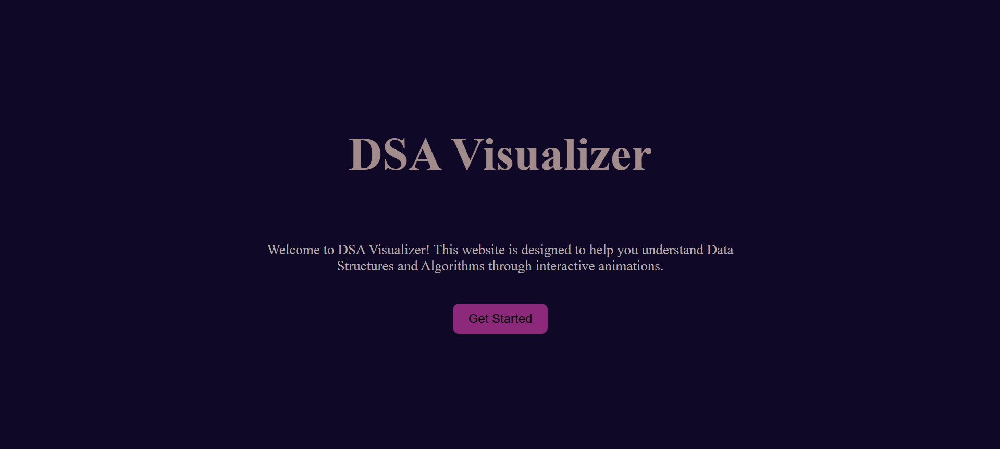

# DSA Visualizer

An interactive web-based visualizer for Data Structures and Algorithms, built with HTML, CSS, and JavaScript.

## Live Demo
> Coming soon

## Preview

### Landing page


### Visualizer


## Features
- Bubble Sort animation with step-by-step visualization
- Color-coded feedback — red for comparisons, green for sorted elements
- Random array generation
- Clean dark-themed UI with sidebar navigation

## Tech Stack
- HTML
- CSS (Flexbox)
- JavaScript (Vanilla)

## Algorithms (In Progress)
- [x] Bubble Sort
- [x] Selection Sort
- [x] Insertion Sort
- [x] Merge Sort
- [x] Quick Sort
- [x] Linear Search
- [x] Binary Search
- [x] Linked List Visualization
- [x] BST Visualization
- [ ] Graph Traversal (BFS & DFS)

## How to Run
1. Clone the repository
   ```
   git clone https://github.com/your-username/DSA-Visualizer.git
   ```
2. Open `index.html` in your browser

## Author
[Nida Hafeez]
